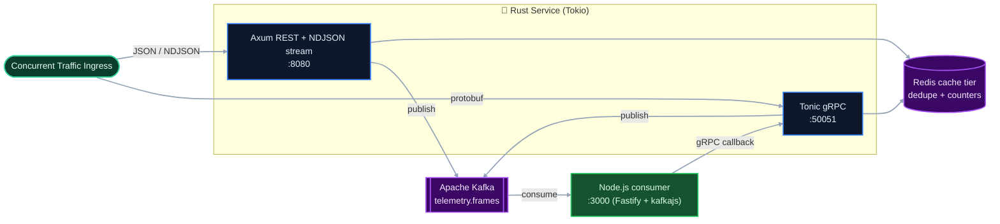

# Distributed Core Systems — High-Throughput Distributed API Layer

A polyglot, event-driven ingestion platform. A native **Rust** microservice (Tokio + Axum + Tonic) ingests high-volume JSON telemetry over **REST**, **NDJSON streaming**, and **gRPC**, deduplicates and counts via a **Redis** caching tier, and publishes every frame to an **Apache Kafka** event bus. A downstream **Node.js** service consumes those events and can call back into the Rust service over gRPC.

## Architecture Topology



## System Stack

| Layer | Technology |
| --- | --- |
| Core service language | Rust 1.85+ (edition 2024) |
| Async runtime | Tokio (`features = ["full"]`) |
| HTTP / routing | Axum 0.8 |
| gRPC | Tonic 0.12 + Prost (protobuf) |
| Caching tier | Redis (`redis` crate, single node **or** cluster) |
| Event bus | Apache Kafka (pure-Rust `rskafka` producer) |
| Downstream service | Node.js 22 (Fastify + KafkaJS + `@grpc/grpc-js`) |
| Serialization | Serde + `serde_json` |
| Observability | `tracing` + `tracing-subscriber` |
| Load testing | k6 script **and** autocannon (Node) |

> **Note:** Edition 2024 requires the **1.85+** stable toolchain. Building the Rust service needs `protoc` (protobuf-compiler) for gRPC codegen.

## Endpoints

### REST / streaming (`:8080`)

| Method | Path | Description |
| --- | --- | --- |
| `POST` | `/api/v1/telemetry` | Ingests a single JSON frame; dedupes, caches, publishes to Kafka. |
| `POST` | `/api/v1/stream` | Memory-efficient NDJSON streaming ingestion (one frame per line). |
| `GET` | `/healthz` | Liveness/readiness probe. |

### gRPC (`:50051`) — `telemetry.v1.TelemetryService`

| RPC | Type | Description |
| --- | --- | --- |
| `Ingest` | unary | Ingests a single `TelemetryFrame`, returns an `Ack`. |
| `IngestStream` | client-streaming | Constant-memory ingestion of a frame stream, returns a `StreamSummary`. |

### Node.js consumer (`:3000`)

| Method | Path | Description |
| --- | --- | --- |
| `GET` | `/healthz` | Liveness probe. |
| `GET` | `/stats` | Rolling counts of consumed Kafka messages / elements. |
| `POST` | `/forward` | Forwards a frame to the Rust gRPC service and returns the `Ack`. |

## Repository Structure

```text
distributed-core-systems/
├── README.md
├── docker-compose.yml              # Full stack: redis, kafka, rust-api, node-consumer
├── distributed-api-layer/          # Rust service
│   ├── Cargo.toml                  # Dependencies + release build profile
│   ├── build.rs                    # Tonic/Prost gRPC codegen
│   ├── Dockerfile                  # Multi-stage, distroless runtime image
│   ├── proto/telemetry.proto       # gRPC contract
│   ├── src/
│   │   ├── main.rs                 # Boots REST + gRPC, graceful shutdown
│   │   ├── config.rs               # Env-driven configuration
│   │   ├── http.rs                 # REST + NDJSON streaming handlers
│   │   ├── grpc.rs                 # Tonic service implementation
│   │   ├── cache.rs                # Redis caching tier (single/cluster)
│   │   └── events.rs               # Kafka event-bus producer
│   ├── infra/main.tf               # Terraform IaC (EKS control plane mock)
│   └── k8s/deployment.yaml         # Kubernetes Deployment + Service
├── services/node-consumer/         # Node.js downstream consumer + gRPC client
│   ├── package.json
│   ├── Dockerfile
│   ├── proto/telemetry.proto       # (kept in sync with the Rust proto)
│   └── src/{index.js,grpc-client.js}
├── loadtest/                       # k6 + autocannon load generators
│   ├── k6/telemetry.js
│   └── autocannon-run.js
└── .github/workflows/ci.yaml       # Rust + Node CI pipeline
```

## Quickstart — Full Stack (Docker Compose)

Spins up Redis, Kafka (KRaft), the Rust API, and the Node.js consumer:

```bash
docker compose up --build
```

Then exercise it:

```bash
# REST ingestion (publishes to Kafka, cached in Redis)
curl -X POST http://localhost:8080/api/v1/telemetry \
  -H "Content-Type: application/json" \
  -d '{"event_id":"tx_9921","metric_signature":"v8_stable","data_points":[1.05, 99.4, 40.2]}'
# {"status":"ACK_RECEIVED_SUCCESS","processed_elements":3,"duplicate":false}

# Watch the Node.js consumer pick the event off Kafka
curl http://localhost:3000/stats
```

## Local Development (Rust only)

The Rust service runs standalone — every integration degrades gracefully when its env var is unset.

```bash
cd distributed-api-layer
cargo run            # REST :8080 + gRPC :50051, no Redis/Kafka required
```

Enable integrations via environment variables:

| Variable | Default | Purpose |
| --- | --- | --- |
| `BIND_ADDR` | `0.0.0.0:8080` | REST listen address |
| `GRPC_ADDR` | `0.0.0.0:50051` | gRPC listen address |
| `REDIS_URL` | _(unset → disabled)_ | e.g. `redis://localhost:6379` |
| `REDIS_CLUSTER` | `false` | `true` to treat `REDIS_URL` as comma-separated cluster nodes |
| `KAFKA_BOOTSTRAP` | _(unset → disabled)_ | e.g. `localhost:9092` |
| `KAFKA_TOPIC` | `telemetry.frames` | Topic for published frames |
| `DEDUPE_TTL_SECS` | `300` | Event-id dedupe window |

### NDJSON streaming

```bash
printf '%s\n%s\n' \
  '{"event_id":"a","metric_signature":"s","data_points":[1,2]}' \
  '{"event_id":"b","metric_signature":"s","data_points":[3,4,5]}' \
  | curl -X POST http://127.0.0.1:8080/api/v1/stream --data-binary @-
# {"frames":2,"processed_elements":5}
```

### gRPC (from the Node client)

```bash
cd services/node-consumer && npm install
node -e "import('./src/grpc-client.js').then(async m=>{const c=m.createTelemetryClient('127.0.0.1:50051');console.log(await m.ingest(c,{event_id:'g1',metric_signature:'v8',data_points:[1,2,3,4]}));c.close();})"
# { status: 'ACK_RECEIVED_SUCCESS', processed_elements: 4, duplicate: false }
```

## Load Testing — toward the 45k req/sec target

Throughput is hardware/network-dependent; these tools let you measure it on your box.

**autocannon** (no system install — pure Node):

```bash
cd loadtest && npm install
TARGET=http://localhost:8080 CONNECTIONS=200 PIPELINING=10 DURATION=20 npm run load
```

**k6** (if installed):

```bash
k6 run -e TARGET=http://localhost:8080 -e RATE=45000 loadtest/k6/telemetry.js
```

## Container Build (Rust service only)

```bash
cd distributed-api-layer
docker build -t jolaboy/distributed-api-layer:latest .
docker run --rm -p 8080:8080 -p 50051:50051 jolaboy/distributed-api-layer:latest
```

## Infrastructure-as-Code & Kubernetes

- **Terraform** ([`infra/main.tf`](distributed-api-layer/infra/main.tf)) — provisions a managed Kubernetes (EKS) control plane with parameterized region, cluster name, and subnets.

  ```bash
  cd distributed-api-layer/infra && terraform init && terraform plan
  ```

- **Kubernetes** ([`k8s/deployment.yaml`](distributed-api-layer/k8s/deployment.yaml)) — a 3-replica `Deployment` + `ClusterIP` `Service` exposing HTTP (`:8080`) and gRPC (`:50051`), with Redis/Kafka env wiring and `/healthz` probes.

  ```bash
  kubectl apply -f distributed-api-layer/k8s/deployment.yaml
  ```

## Continuous Integration

[`.github/workflows/ci.yaml`](.github/workflows/ci.yaml) runs two jobs on every push/PR to `main`:

- **build-and-test** — installs `protoc`, then runs `cargo fmt --check`, Clippy (warnings as errors), a release build, and tests.
- **node-consumer** — installs Node deps and syntax-checks the consumer service.

## Implementation Notes & Honesty

- The **< 45MB footprint** is a target for the lean REST-only profile; the full stack (gRPC + Kafka + Redis clients) is given headroom in the k8s manifest.
- The **45k req/sec** figure is a target to validate with the included load tests on your own hardware, not a guaranteed benchmark.
- Redis and Kafka integrations **fail open**: if a backend is unreachable, ingestion continues and the condition is logged.